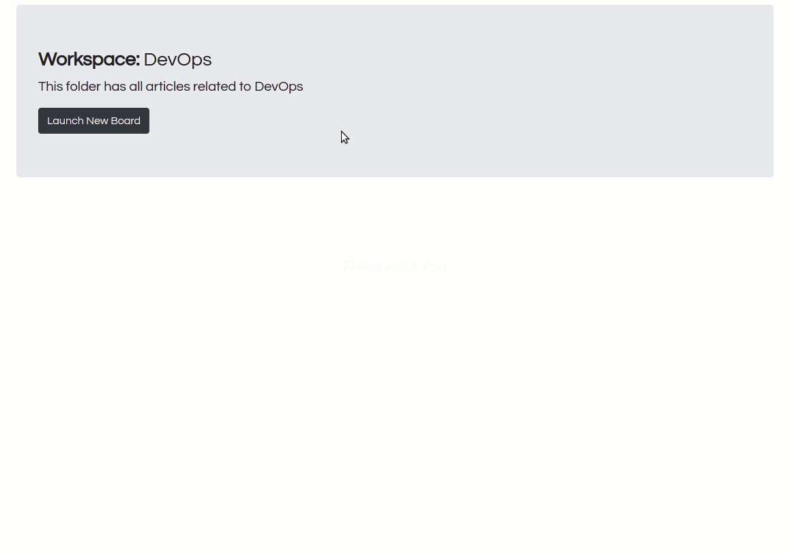
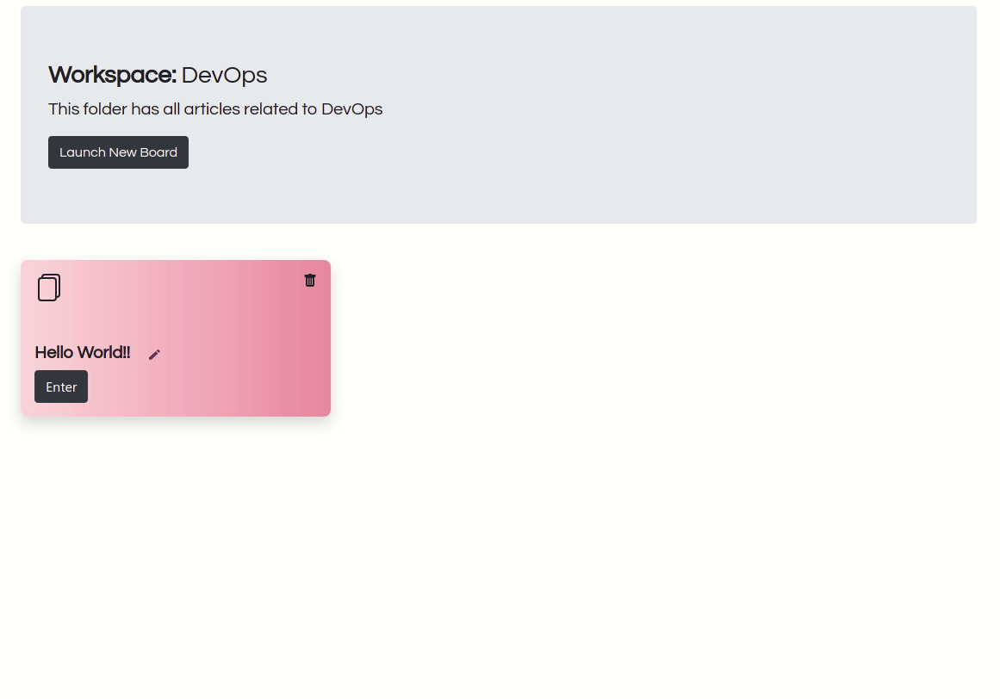
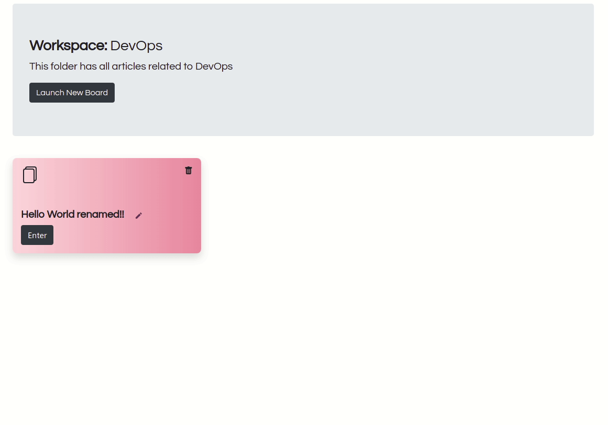

## Creating  a Board

After entering your workspace. Click on “launch new board” to create a creative board🎉.

## Renaming a Board

Rename your board in the workspace collections by clicking on the pencil icon or after opening inside the file.

## Deleting a Board

Click on the trash icon to delete the board

:::warning

click on sure to confirm before deleting the workspace

:::

