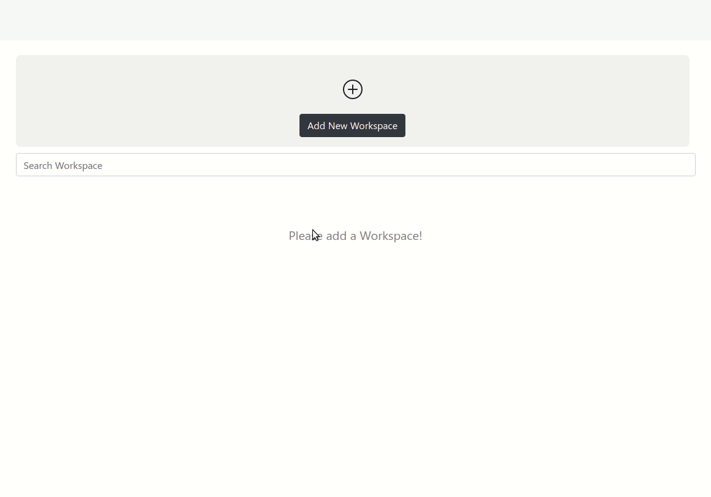
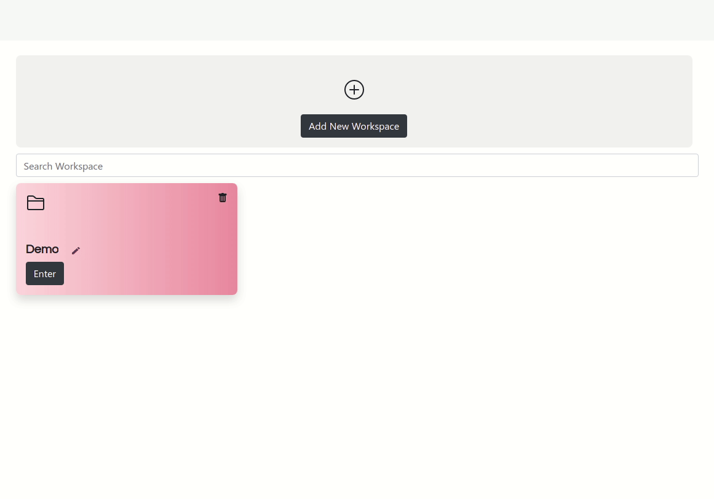

## Creating new Workspace

After successful login, Click on “Add New Workspace”, add a unique name and a concise description (optional) and click on “Save changes” to create a new workspace🎉.

## Renaming a Workspace

Rename your workspace by clicking on the pencil icon next to the name of your workspace on the home page. Modify accordingly and click on the green tick to save your changes.

:::note

If you don’t want to, click on the red cross icon.

:::

## Deleting a Workspace

Click on the trash icon to delete the workspace
:::warning

click on sure to confirm before deleting the workspace

:::

